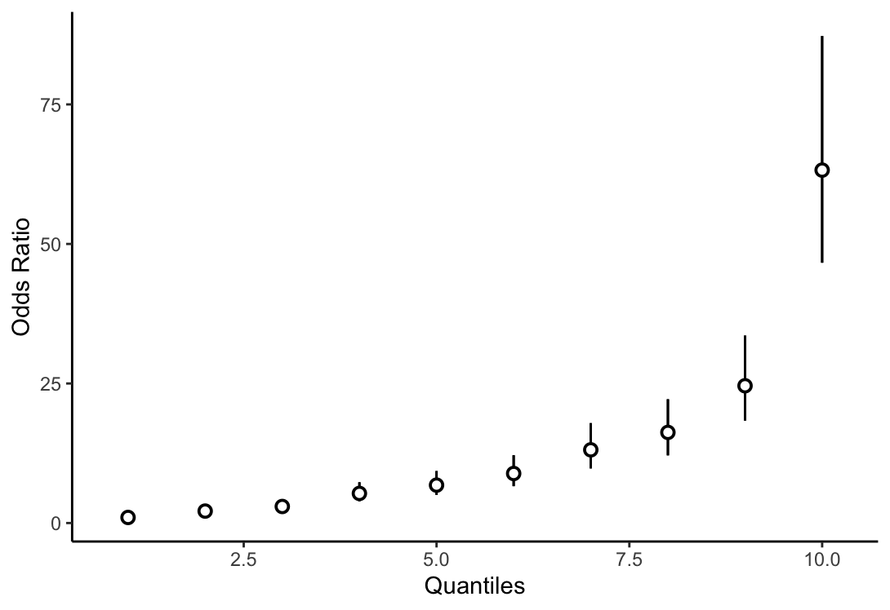

# PRSmetrics

`PRSmetrics` is an R package to calculate common metrics often used to evaluate Polygenic Score (PGS) performance. 

calc_or():
  - Calculate odds Ratios (OR) across PGS quantiles for binary outcomes (e.g., compare risk of disease in the top 10% vs. bottom 10%)


You can install the development version of this package from GitHub:
```r
# install.packages("devtools")
devtools::install_github("lucivargas/PRSmetrics")
```

Dependencies:
```markdown
- dplyr
- ggplot2
- epitools
- stats
- magrittr
```

## Example: Simulating a PGS dataset and calculating ORs

```r
library(PRSmetrics)

# Simulate PGS dataset
set.seed(123)
n <- 10000
pgs <- rnorm(n, mean = 0, sd = 4)
beta <- 0.3
mu <- qlogis(0.3)
prob_case <- plogis(mu + beta * pgs)
outcome <- rbinom(n, size = 1, prob = prob_case)

# Run the function
res <- calc_or(pgs, outcome)

# View results
res$results
res$quantiles
res$plot
```

<div align="center">
  
</div>
